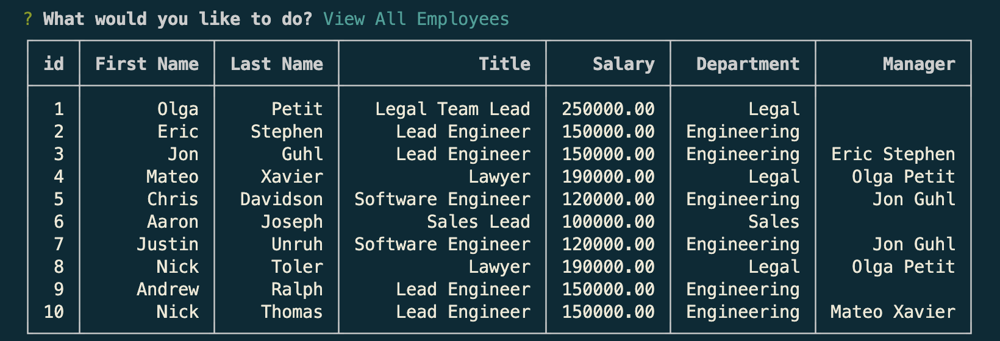

# OrganizeTheGang

- Here I have set up a database using Express/[NodeJs](https://nodejs.org/en/download/) and [MySQL](https://dev.mysql.com/downloads/mysql/) 
- This database will allow you to keep track of all the employees in your company. You will be able to assign them job titles, make departments, add employees and more.

## Installation 

- Make sure you have [NodeJs](https://nodejs.org/en/download/) and [MySQL](https://dev.mysql.com/downloads/mysql/) installed or this application will not run

## Usage 

- 1. Clone this repository 

- 2. After you've cloned the repository, `cd` into the directory you cloned the repository into

- 3. Assuming you're in the correct directory at this point, now you will run `npm install` in the command line

- 4. So before you can run this youll need to create a database locally. So to do that, from the command line you will run `mysql -u root -p`, after that you will run `source schema.sql` or `source mysql/schema.sql` depending on what directory of the repository you are in in the command line. 

- 5. (OPTIONAL) If you would populate the database with a preset database after youve run the `source schema.sql` you can run `source seeds.sql` or `source mysql/schema.sql` depending on what directory of the repository you are in in the command line. 

- 6. After you've created the database and populated the preset information(or not) run `npm start` to start the application

- Here's some examples of what you will see as you navigate the application 
- 
- 

- From there feel free to play around and add whatver type of information you'd want to add to your own local database!

